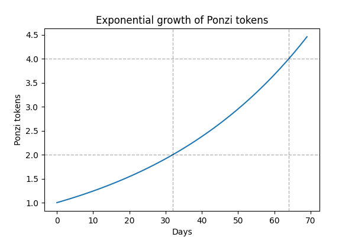

# Simple Ponzi scheme

I'm tired of different types of pyramid schemes aka Ponzi schemes in the crypto
world. So I made my own Ponzi scheme smart contract that everyone can play on
the testnet. Stop spending real money, start spending testnet ether.

Any user can invest an arbitrary amount of ether and receive an equal number of
Ponzi tokens in return. Every midnight, the number of tokens on the account of
each user increases. The growth of tokens is exponential, doubling every 32
days.

So by investing 1 ether you will get 1 token. After 32 days you will have 2
tokens, after 64 days you will have 4 tokens, and so on.

At any time, tokens can be exchanged for an equal amount of ether. But this can
only be done as long as there is a sufficient amount of ether on the smart
contract account, that is, as long as other users contribute this ether.
If there is not enough ether, then you have worthless tokens left in your
account. This is how Ponzi schemes work.

## Technical details

In order not to recalculate all balances every midnight, the user's balance is
calculated when the function `balanceOf(...)` is called. That is, if the user
has 1 token, then after 32 days the `balanceOf(...)` function will return 2
tokens, after 64 days - 4 tokens. When depositing ether, the number of tokens
is converted to the time the contract was created. That is, when depositing 1
ether after 32 days after contract creation, the user will receive 0.5 internal
tokens. But since the internal token will cost 2 ether by this time, the
`balanceOf(...)` function will return the value of 1 token. The same conversions
are done in `transfer(...)`, `transferFrom(...)` and `totalSupply()` functions.

No conversions are done in the `approve(...)` function. The permission to
transfer a token equal to 1 ether will remain the same regardless of the
elapsed time.

## Deployment

The smart contract is located at an address
`0x933033cb97Df7fb4b32453b4aaa6776C4dC8Cee0`
in the Goerli testnet.

Project scripts can be used for deposit or withdrawal. You need to create a
`.env` file with `GOERLI_URL` and `PRIVATE_KEY` variables. For a deposit,
specify the desired amount `depositAmount` in the `scripts/deposit.js` file.
Then run the `npm run deposit` command. The withdrawal is similar.

## Problems

- Since the recalculation takes place at UTC midnight, if you deposit ether
before midnight, then immediately after midnight you can withdraw 2.19%
($= 2^{1/32} - 1$) more ether. This allows you to extract ether from the smart
contract balance with almost no risk.
- An overflow is possible in the `convertToCurrentTime(amount)` and
`convertToInitialTime(amount)` functions due to the lack of floating point
operations in Solidity. But this will require an extremely large amount
of ether.
- The event logs record the number of internal tokens, since the logs cannot
change over time.
